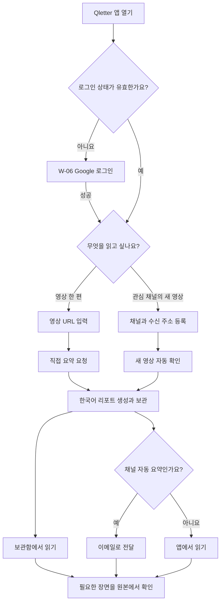
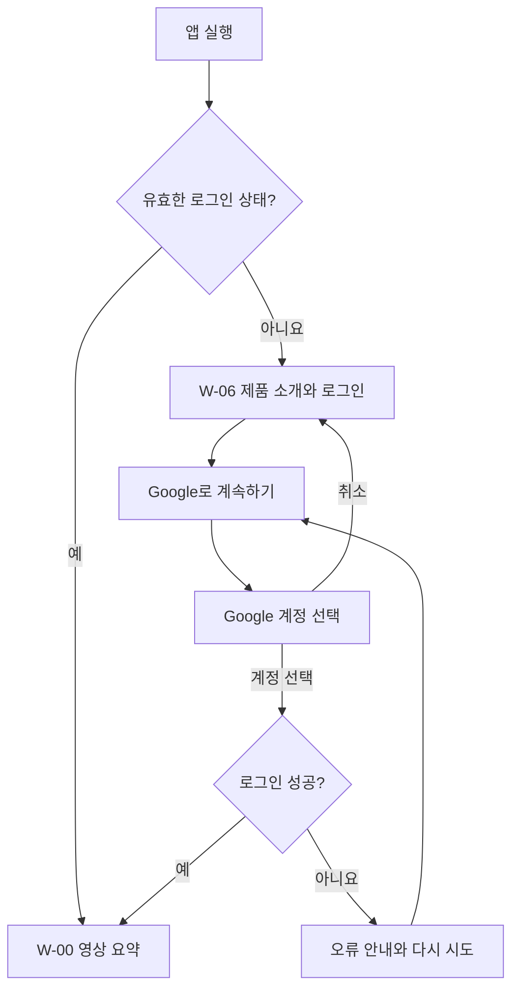
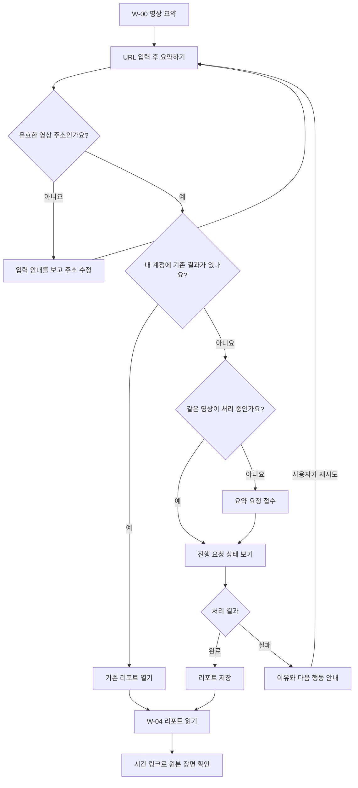
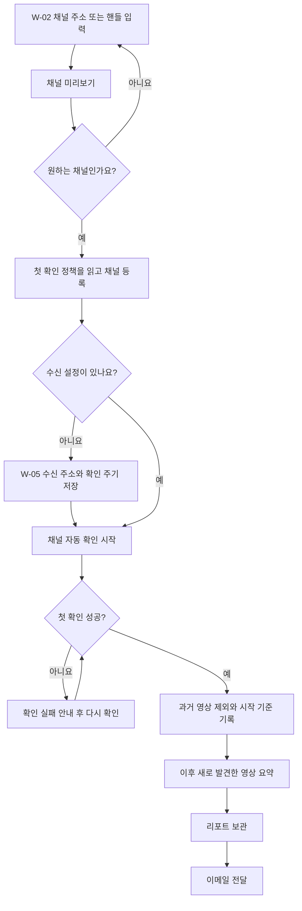
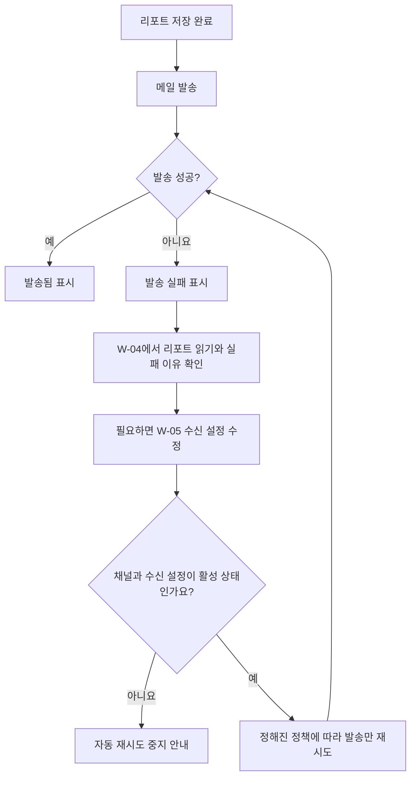

# Qletter 사용자 흐름

Qletter는 YouTube 영상을 한국어 리포트로 읽고 보관하는 안드로이드 앱이에요. 사용자는 영상 URL 하나로 시작하거나 관심 채널의 새 영상을 자동으로 받아볼 수 있어요.

이 문서는 사용자인터페이스 과목 팀프로젝트의 사용 시나리오예요. 개인 기능은 Google 계정으로 로그인한 후 이용해요. 각 흐름에서 **사용자의 목적 → 행동 → 결과 → 예외**를 따라가요. 화면 번호는 [와이어프레임](03-wireframes.md), 기능 번호는 [기능 명세](02-functional-spec.md)와 연결돼요.

## 1. 전체 경험

**예시**: 공유받은 강연은 링크로 한 번 요약해요. 자주 보는 강연 채널은 등록해 새 영상의 리포트를 계속 받아요. 두 결과는 같은 보관함에서 다시 찾을 수 있어요.

## 2. U-00 · 로그인과 내 계정 시작하기

**목적**: 내 리포트와 채널을 저장하고 다음에도 이어서 이용해요.

첫 계정 선택으로 시작하고 별도 비밀번호 가입은 요구하지 않아요. 로그인 후 보관함·채널·설정은 해당 계정의 기록만 보여줘요. Google 로그인은 앱의 본인 확인이며 YouTube 구독 목록을 자동으로 불러오는 동의가 아니에요.

**연결**: F-11 / W-06 → W-00.

## 3. U-01 · 영상 한 편을 바로 읽기

**목적**: 긴 영상의 핵심을 파악하고 필요한 부분만 원본에서 확인해요.

**시작 조건**: 로그인한 상태이고 요약할 영상 URL이 있어요. 채널 등록이나 이메일 설정은 필요하지 않아요.

| 단계 | 사용자 경험 |
| --- | --- |
| 입력 | 영상 주소 하나를 넣고 요청해요. |
| 대기 | 대상 영상과 처리 상태를 확인해요. 다른 화면으로 이동해도 다시 돌아올 수 있어요. |
| 완료 | 리포트를 읽고 필요한 장면만 원본에서 봐요. 결과는 보관함에 남아요. |
| 재방문 | 같은 영상을 다시 요청하거나 보관함에서 찾아 기존 결과를 읽어요. |

**예외**: 영상에 접근할 수 없으면 주소나 공개 여부를 확인해요. 상태 조회만 실패했다면 조회만 다시 하고 분석을 새로 시작하지 않아요. 직접 요약은 채널 구독이나 이메일 발송으로 이어지지 않아요.

**연결**: F-01~04 / W-00 → W-04 → W-03.

## 4. U-02 · 관심 채널을 등록하고 자동으로 받기

**목적**: 매번 새 영상 링크를 복사하지 않고 관심 채널의 내용을 받아봐요.

첫 확인 직후 리포트가 없어도 정상일 수 있어요. 이전 영상을 한꺼번에 보내지 않기 위한 정책이에요. 첫 확인이 성공했는지와 앞으로 무엇을 받을지 화면에 알려줘요. 과거 영상 중 원하는 한 편은 직접 요약으로 요청할 수 있어요.

**예외**: 새 영상 확인이나 요약이 실패하면 해당 상태를 알려줘요. 확인 작업의 종료를 모든 리포트 생성·발송의 성공으로 표현하지 않아요.

**연결**: F-05~09 / W-02 → W-05 → W-01 → W-04·이메일.

## 5. U-03 · 메일을 못 받았지만 리포트는 있는 경우

**목적**: 만들어진 글을 바로 읽고 메일 문제를 복구해요.

재시도에는 저장한 본문을 사용해요. 영상을 다시 분석하지 않고 이미 발송에 성공한 수신 주소에는 중복 메일을 보내지 않는 방향이에요. 재시도 한도에 도달하면 멈춘 상태와 다음 행동을 안내해요.

직접 요약의 `발송 안 함`은 정상 상태예요. 메일 오류 복구 흐름에 들어오지 않아요.

**연결**: F-03, F-07~09 / W-01 또는 W-03 → W-04 → W-05.

## 6. U-04 · 이전에 읽은 내용을 다시 찾기

**목적**: 기억나는 내용을 다시 읽거나 원본의 근거를 확인해요.

1. W-03 보관함에서 제목으로 검색해요.
2. 필요하면 채널·생성 경로·발송 상태로 범위를 좁혀요.
3. 리포트를 열어 세 줄 요약을 훑어요.
4. 목차로 필요한 설명을 찾아 읽어요.
5. 시간 링크를 눌러 원본 장면을 확인해요.
6. Android 뒤로 가기나 상단 화살표로 검색·스크롤 위치를 유지한 목록으로 돌아가요.

**예외**: 결과가 없으면 검색 조건을 바꿔요. 본문을 불러오지 못하면 조회를 다시 해요. 두 경우 모두 새로운 영상 분석을 시작하지 않아요.

**연결**: F-03, F-04, F-10 / W-03 → W-04 → 원본 영상.

## 7. U-05 · 채널 자동화를 멈추거나 다시 켜기

| 사용자 행동 | 기대 결과 | 화면 안내 |
| --- | --- | --- |
| 일시 중지 | 새 영상 확인과 대기 메일 재시도가 멈춰요. | 중지 범위와 기존 리포트 보존을 알려줘요. |
| 다시 켜기 | 설정이 유효하면 새 영상 확인을 재개해요. | 중지 기간 전체를 자동 복구한다고 약속하지 않아요. |
| 채널 삭제 | 등록 목록에서 빠지고 해당 자동 처리가 멈춰요. | 확인 대화상자에서 결과를 알려줘요. |
| 삭제 후 보관함 열기 | 이전에 만든 리포트를 계속 읽어요. | 해당 채널의 글을 검색할 수 있어요. |

놓친 영상 한 편을 읽고 싶으면 W-00에 URL을 넣어요. 자동 채널을 다시 등록하는 것이 과거 전체 요약 요청으로 해석되지 않게 해요.

**연결**: F-04~08 / W-02 → W-03 또는 W-00.

## 8. U-06 · 로그아웃과 다시 로그인하기

1. W-05 설정에서 현재 로그인한 계정을 확인해요.
2. `로그아웃`을 눌러 보관 데이터는 남고 채널 자동화는 별도로 중지해야 한다는 안내를 읽어요.
3. 확인하면 W-06으로 돌아가고 이전 계정의 개인 화면과 표시 데이터를 지워요.
4. 같은 계정으로 다시 로그인하면 내 기록을 불러와요.
5. 다른 계정으로 로그인하면 그 계정의 보관함과 설정만 보여줘요.

로그아웃 후 Android 뒤로 가기나 이전 상세 링크로 다른 사용자의 데이터를 열 수 없어야 해요. 앱을 닫거나 로그아웃했다고 이미 접수한 요약을 취소한 것으로 해석하지 않아요. 다음 로그인 때 해당 계정의 상태를 다시 조회해요.

**연결**: F-02, F-10, F-11 / W-05 → W-06 → W-00.

## 9. 사용성 평가에서 확인할 질문

| 흐름 | 확인할 질문 |
| --- | --- |
| 로그인 | 계정 선택·취소·실패·재시도를 구분하고 스스로 진행하나요? |
| 첫 직접 요약 | 별도 설명 없이 영상 링크를 넣고 결과를 읽을 수 있나요? |
| 처리 대기 | 완료됐는지, 기다려야 하는지, 재시도해야 하는지 구분하나요? |
| 첫 채널 등록 | 왜 과거 영상이 바로 오지 않는지 이해하나요? |
| 메일 실패 | 리포트는 읽을 수 있다는 사실을 알아차리나요? |
| 보관함 재방문 | 원하는 글과 원본 장면을 쉽게 찾나요? |
| 채널 중지·삭제 | 앞으로 멈추는 것과 남는 것을 이해하나요? |

사용 한도·요금 안내는 팀에서 정책을 정한 뒤 이 흐름에 연결해요. 수업 시연에서는 Android 기기에서 로그인부터 결과 재열람까지 이어지는지 확인해요. 핵심 경험은 **선택 → 이해 → 보관 → 원본 확인**이에요.
